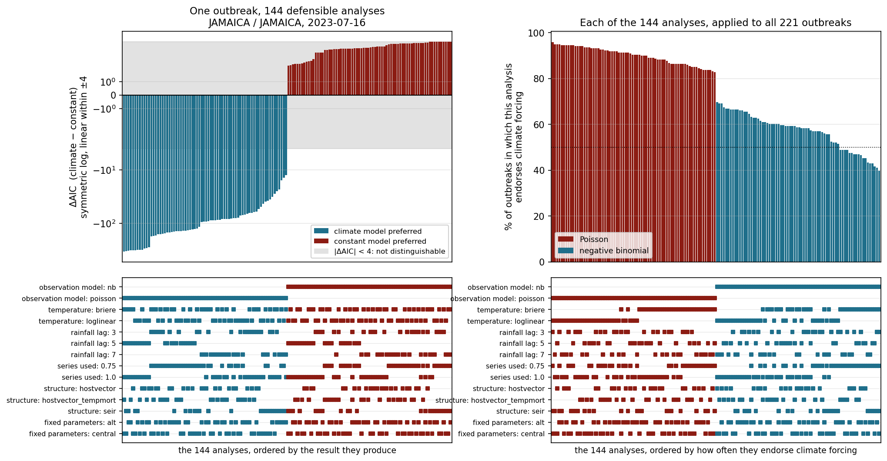
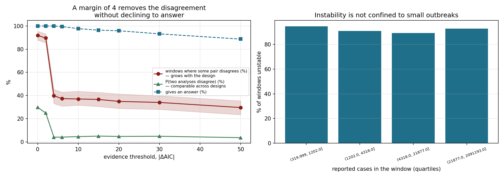
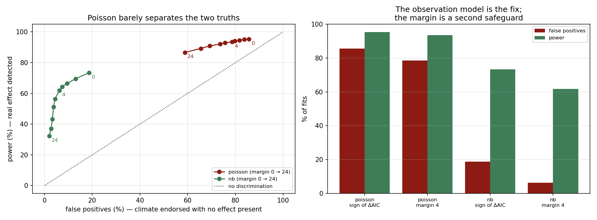

# How much of the evidence for climate-driven dengue transmission survives the analyst?

[](https://doi.org/10.5281/zenodo.21984527)
[](https://doi.org/10.5281/zenodo.21854302)
[](LICENSE)
[](tests/)
[](requirements.txt)

A multiverse analysis across **221 dengue outbreaks in 33 countries**. Each outbreak is
fitted under every combination of six routine analysis choices — 144 of them, 33,152 fits —
and the question asked is not whether climate forcing wins but how often the answer
**changes** when those choices change.

**Headline: roughly three-quarters of the variation in whether an outbreak is judged
climate-driven is variation between analyses of the same outbreak — not between outbreaks.**
76.5% on the 144-analysis design, and 78–80% on smaller designs of the same data. Everything
that differs between epidemics — climate, density, wealth, serotype, surveillance — competes
for the remaining quarter.

That matters because reviews of this literature explain its conflicting findings by
appealing to local context, and a recent meta-analysis of 358 published correlations
formalised that explanation. The explanation needs the variation to sit between *places*.
At most a quarter of it does.

**But the remainder is not the method either.** Split three ways — the design is completely
crossed, so the partition is exact:

| | Share of the variation |
|---|---|
| Outbreak | 23.5% |
| Analysis | 15.9% |
| **Outbreak × analysis interaction** | **60.6%** |

The biggest term belongs to neither. Which analysis endorses depends on *which outbreak*,
so no house style settles it: standardising the conventions can only reach the 16%. This is
also the term a specification curve cannot show — the curve orders specifications by their
average result, which is the definition of a main effect, and averages the interaction away.
It is the reason the recommendation this project ends on is an interval computed **within
each outbreak** rather than a fixed convention.

**Can you tell in advance which choices will bite you?** Only for the one with a mechanism.
The effect of assuming Poisson counts is largest exactly where the counts are most
overdispersed (ρ = +0.31, p = 2×10⁻⁶) — measured by an index that touches no part of the
factorial, which is independent corroboration of *why* the observation model dominates.
Four things visible before fitting explain **34%** of that factor's outbreak-to-outbreak
variation and a median of **1.8%** for the other five. The rainfall lag is the extreme case:
it flips one verdict in six, and **0.1%** of when it does so is predictable. You cannot know
whether your lag choice mattered without trying the others.

Put another way: two analyses of the same outbreak, drawn at random, reach opposite verdicts
**29.8%** of the time against a maximum possible 50%. In **91.9%** of outbreaks some pair of
the 144 disagrees — but that last figure grows with the size of the design and the first two
do not, so it is not the one to carry away. See
[how the headline moved as the design grew](#holding-this-study-to-its-own-standard).

**And it lands on the number the field reports.** The same partition applied to estimated
R₀, on the log scale:

| | Outbreak | Analysis | Interaction |
|---|---|---|---|
| R₀ under the **constant** model | 71.6% | 5.3% | 23.0% |
| R₀ under the **climate** model | 22.5% | 8.4% | **69.1%** |

The analysis main effect is about a twentieth either way — there is no systematically
high-reading method to stop using. Adding climate terms moves variation out of the outbreak
and into the **interaction**. No convention anyone could agree on would fix it.

A constant model's R₀ is mostly about the epidemic, which is what an estimate is for. The
median outbreak's R₀ ranges over **1.31** across the 144 analyses, against a median estimate
of **1.29** — the spread the choices induce is about the size of the thing being estimated.
The contrast survives every treatment of the long right tail we tried.

**Does the real data look like a literature detecting nothing?** No, and this is measurable
because the simulation has a known truth. Same windows, same 144 analyses, only the truth
differs:

| | Outbreak | Analysis | Interaction |
|---|---|---|---|
| simulated, **no** climate effect | 10.9% | **47.0%** | 42.1% |
| simulated, **real** effect present | 28.6% | 10.3% | 61.1% |
| **real outbreaks** | **23.5%** | **15.9%** | **60.6%** |

The analysis main effect discriminates: with nothing to detect, the answer is whatever your
convention gives and the convention doesn't vary by window, so that term dominates. The real
data sits with the effect arm on all three components. Two earlier one-number attempts at
this comparison pointed in opposite directions and one was withdrawn — the arms differ in
three dimensions and a single statistic cannot separate them.

**The factors separate along a line worth stating plainly.** The *statistical conventions*
dominate: which likelihood (34% of verdicts flipped), how much of the series to fit (21%).
The *epidemiological content* matters least: which transmission mechanism (9–10%), and what
the fixed biological parameters are (**3%**). The question is answered by the statistics,
not by the biology.

**The objections do not hold.** Throw away the Poisson half of the factorial as
indefensible and **79.6%** of outbreaks still change verdict. Replace the host–vector model
with a directly transmitted SEIR, or give its mosquitoes temperature-dependent mortality,
and the verdict moves less than any statistical convention does.

**A remedy still works, but you have to measure it correctly.** Abstaining where
|ΔAIC| < 4 cuts pairwise disagreement from 29.8% to **4.0%** while still answering for
every outbreak. On the share-of-outbreaks scale the same rule looks far weaker (92% → 40%)
— which is the same enumeration artefact, and reading it without noticing nearly cost this
project its conclusion.

**Reaching for a stricter criterion instead makes it worse.** BIC and a likelihood-ratio
test at p < 0.01 are unstable in 96.8% and 97.3% of outbreaks — worse than AIC's 91.9%. The
choices move ΔAIC by a median of **804 units** within one dataset, fifty-six times the
median difference being read as evidence. A stricter threshold relocates the boundary; it
does not remove it.

**So does climate drive dengue transmission?** Applying this project's own recommendation
to its own data — negative binomial only, abstain where |ΔAIC| < 4 — gives a clear verdict
for **137 of 221** outbreaks, of which **86% support climate forcing**. The claim here is not
that the effect is absent. It is that the confidence with which the question is currently
answered is not earned, and that in **38% of outbreaks a single season cannot settle it**.

**And the fix is cheap.** Combining just **eight** analyses by Rubin's rules restores a 95%
interval to nominal coverage; four already reach it, and eight are indistinguishable from
seventy-two. That is a few minutes on one processor, not a factorial.

**Status:** posted as a preprint (https://doi.org/10.5281/zenodo.21984527); not yet peer reviewed. See
[`docs/SUBMISSION.md`](docs/SUBMISSION.md) for where it is going and in what order.

---

## What this is, methodologically

A **multiverse analysis** ([Steegen et al. 2016](https://doi.org/10.1177/1745691616658637))
or **specification curve** ([Simonsohn et al. 2020](https://doi.org/10.1038/s41562-020-0912-z)):
enumerate the defensible analyses instead of reporting one, and treat the spread of results
as the finding. Those literatures grew up around regression, where the forking paths are
covariate sets and exclusion rules. Mechanistic transmission models fork differently — the
observation distribution, the functional form of a biological response, a lag with a
mechanistic justification but no agreed value, the compartmental structure itself — and
none of those has an analogue in a covariate list. Each is normally presented as part of
*the model* rather than as an analytical degree of freedom, which is exactly why nobody
reports them.

Two things follow that a regression multiverse does not face. Fits can fail to converge, so
the multiverse is not guaranteed to be complete and has to say which cells are missing. And
the comparison is between nested mechanistic hypotheses judged by an information criterion,
which makes the decision rule itself — where the threshold sits, and whether it abstains —
a lever that can be tested rather than assumed. That is what turns this from a complaint
into a recommendation.

## Research questions

1. Across outbreaks worldwide, how often does the in-sample verdict on climate-driven
   transmission depend on the analyst's unremarked choices rather than on the data?
2. Which choice matters most, and does out-of-sample validation remedy it?
3. What can be identified at all from routine single-season surveillance — and what
   cannot, however carefully it is fitted?

The Pakistani analysis below came first and motivated all three. It is retained in full
because it is where each mechanism was found and diagnosed; the global study is where it
was established that the mechanisms generalise.

## Data

| Source | Content | Licence |
|---|---|---|
| [OpenDengue](https://opendengue.org) v1.3 | Weekly reported dengue cases, Pakistan, national and subnational | CC-BY 4.0 |
| [NASA POWER](https://power.larc.nasa.gov) | Daily temperature, precipitation, relative humidity | Public domain |

Raw data is **not committed to this repository**. Run `scripts/00_download_data.py` to
fetch it; provenance, versions and checksums are recorded in [docs/DATA.md](docs/DATA.md).

Two windows are used:

- **2012-12-23 to 2014-06-08** — 77 consecutive weeks of national reporting covering one
  complete epidemic wave (peak 2,184 cases/week; 42,880 cases total).
- **Aug 2021 to Jan 2022** — shorter provincial and district series (Sindh, Khyber
  Pakhtunkhwa and constituent districts) used for the aggregation-bias comparison.

Punjab has no usable subnational series in OpenDengue (28 weekly records, 6 cases in
total); this is a known gap in South Asian subnational coverage, documented by the
OpenDengue authors.

## Model

A host–vector compartmental model. Humans move through susceptible, infected and
recovered states; mosquitoes through susceptible and infected states, without recovery,
since an infected mosquito remains infectious for life.

Transmission is climate-forced: the composite transmission coefficient depends on
temperature and on lagged rainfall, both of which govern mosquito abundance and the
extrinsic incubation period. Reported cases are modelled as a fraction of incident
infections, so that under-ascertainment is estimated rather than ignored.

Full specification: [docs/MODEL.md](docs/MODEL.md).

## Findings so far

Work in progress; nothing peer reviewed. The full decision trail, including the
formulations that failed and why, is in [docs/ANALYSIS_LOG.md](docs/ANALYSIS_LOG.md).

**R₀ for these dengue waves is 1.4–1.7**, estimated independently from the 2013 national
series and the 2021 Sindh and Khyber Pakhtunkhwa series — three windows, two of them
eight years apart. **It should be read as a lower bound**, for two independent reasons
established below: spatial aggregation depresses it, and the observed early growth rates
require more.

**Spatial aggregation biases the estimate downward.** Fitting the districts of a province
separately and then fitting their sum gives different answers. In Sindh the aggregate sits
inside the district range (bias −2.2%); in Khyber Pakhtunkhwa the aggregate estimate of
1.14 falls **below both districts it is composed of**, 1.25 and 1.96 — a bias of −29%.
Component epidemics peak at different times, so their sum is broader than any of them, and
a homogeneously mixing model can only read a broader curve as slower transmission. The
national series aggregates the entire country.

**The epidemics grow faster than the fitted R₀ permits.** An independent check using no
compartmental fit — the exponential growth rate of the early epidemic, bounded both ways
for the unknown generation-interval distribution — puts R₀ between 2.9 and 6.8 nationally,
2.1 and 2.9 in Sindh, 1.8 and 2.2 in Khyber Pakhtunkhwa. Every fitted value falls below
the corresponding lower bound. A homogeneous model ties growth rate to final size through
a single R₀, and these epidemics rise faster than their eventual size allows, which is the
same spatial heterogeneity showing up from a second direction.

**Heterogeneity is the cause, and that was tested rather than asserted.** A two-patch
model fitted to the Khyber Pakhtunkhwa aggregate — given only the aggregate series, and
told nothing about which districts contributed or when they peaked — beats the
single-patch fit by ΔAIC = −8.6, recovers transmission rates of 1.72 and 2.53 where the
single-patch fit sat below both districts at 1.14, and clears the growth-rate lower bound
the single-patch fit violated. It also infers a 46-day offset between its two components,
matching the real asynchrony between the districts. An aggregate does not uniquely
determine its decomposition, so this establishes that a heterogeneous structure explains
the discrepancy and a homogeneous one cannot — not that this particular split is correct.

**The reporting fraction and the population at risk cannot both be estimated.** They enter
the prediction only as a product, verified numerically: halving one while doubling the
other changes the fitted curve by exactly zero. Fixing the reporting fraction at a census
population produced an estimate of one reported case per ten thousand infections, three
orders of magnitude from any published figure — the parameter was absorbing an error in
the denominator, because it was the only one free to.

**Climate forcing is not supported by these data**, and three routine analysis choices
were each found to reverse the in-sample conclusion:

- **The functional form of the temperature term.** A log-linear coefficient fitted to a
  season whose temperature falls while the epidemic grows returns a large negative effect
  regardless of biology. Replacing it with a unimodal response derived from *Aedes*
  thermal limits made the effect vanish rather than reverse.
- **The observation model.** Assuming Poisson counts, when the observed dispersion is 164,
  rewards the extra flexibility of the climate terms for chasing noise. Under a negative
  binomial the national ΔAIC moved from −388, an overwhelming preference for climate
  forcing, to +1.3 against it. Nothing about the data changed; only the assumed variance.
- **How much of the series is fitted.** On the full window the national ΔAIC is −31.8 in
  favour of climate forcing; on the first 75% it is +1.3 against. Sindh reverses in the
  opposite direction. Both are defensible analyses; neither is a mistake.

On the Pakistani windows, held-out deviance preferred the constant-transmission model in
every configuration tested, which suggested that out-of-sample validation was the one
stable criterion. **The global study shows that conclusion was wrong** — see below. It
survived three windows and did not survive 236.

## The global study

`scripts/14_global_windows.py` through `17_robustness_analysis.py`. 236 outbreaks from 34
countries, each fitted under 144 combinations of six choices against two models: **33,152
fits**. 221 outbreaks completed the full factorial and are analysed; four could not be
fitted at all and twelve completed only part of it, since a window finishing part of the
design would look stable or unstable for reasons unrelated to the choices.

**In 91.9% of outbreaks some pair of analyses disagrees.** Eighteen windows always favour
climate forcing; none never does; 203 split. Among those the median is 107 of 144
combinations in favour. The instability holds in every well-represented country
(85%–100%).

### Holding this study to its own standard

A study that keeps adding factors until its headline is large is doing what it criticises.
Every design this project ran, with the design-invariant statistic beside the one that
grows mechanically:

| Design | Combinations | Outbreaks | Some pair disagrees | P(two disagree) |
|---|---|---|---|---|
| Four factors | 24 | 236 | 82.6% | 29.9% |
| Five factors | 48 | 234 | 88.0% | 31.4% |
| **Six factors** | **144** | **221** | **91.9%** | **29.8%** |

The middle column climbs because asking whether *any* two cells disagree is easier the more
cells there are. The right column is a function of the proportion, not the count, and is
flat. Each factor added closed a gap the *previous* version had named in its own
limitations — and the one added with most concern, the fixed biological parameters, turned
out to be the weakest of the six.

**The observation model dominates.** Paired within window, so series length and case count
cannot drive it:

| Choice varied | Verdicts that flip | P(climate wins) before → after |
|---|---|---|
| *Statistical conventions* | | |
| **Negative binomial → Poisson** | **34.3%** | 0.570 → 0.900 |
| 75% → 100% of the series | 20.7% | 0.702 → 0.769 |
| *Covariate handling* | | |
| Rainfall lag 3 → 7 weeks | 15.8% | 0.734 → 0.738 |
| Brière → log-linear temperature | 11.5% | 0.696 → 0.774 |
| Rainfall lag 3 → 5 weeks | 11.0% | 0.734 → 0.733 |
| *Epidemiological content* | | |
| Host–vector → human-only SEIR | 9.9% | 0.738 → 0.727 |
| Host–vector → thermal mortality | 9.4% | 0.738 → 0.741 |
| **Fixed parameters, central → alternative** | **3.1%** | 0.735 → 0.736 |

The rainfall lag is worth noting separately: it flips one verdict in six while barely
moving the average, which is variance injected into a conclusion by an arbitrary choice
rather than a systematic effect.

**The same finding as a rate: 56 percentage points.** Give each of the 144 analyses the
whole study and ask how often it endorses climate forcing. The most credulous — Poisson
counts, a log-linear temperature term, a three-week lag, 75% of the series, an SEIR
structure, the central parameters — endorses it in **95.9%** of outbreaks. The least
credulous differs from it in **exactly two of the six** choices, and both are statistical
conventions rather than biology: negative binomial instead of Poisson, Brière instead of
log-linear. Same lag, same fraction, same structure, same parameters. It endorses climate
forcing in **39.8%**.
Neither is a choice a reviewer would reject on sight.



Left: all 144 analyses of the most evenly split outbreak in the study (Jamaica, July 2023 —
exactly 72 for, 72 against), on a symmetric-log scale that is linear inside ±4 so both
directions stay visible. ΔAIC runs from −337 to +4 on one dataset. The observation-model row
in the panel below splits the figure almost exactly. Right: each analysis applied to all 221
outbreaks.

**Out-of-sample validation halves the endorsement rate but is equally unstable.** Climate
forcing is preferred in 70.3% of fits in-sample and 36.3% of the same fits out-of-sample —
a large and useful reduction. But the *stability* is not improved: 84.7% of windows are
unstable in-sample and **90.6%** out-of-sample. Smaller designs found the two equal;
enlarging the design puts out-of-sample above in-sample, which is the opposite of what a
remedy would do. Validation reduces false endorsement; it does
not make the conclusion independent of the analyst.

**The conventional temperature term reports an essentially arbitrary sign.** The
log-linear coefficient is negative in 48.5% of fits and positive in the rest, averaging to
zero to three decimal places. Read from Pakistan alone its negative value looked like a systematic artefact;
across 236 outbreaks the sign is close to a coin flip, set by whether temperature happens
to be rising or falling during that epidemic's growth phase. The unimodal response derived
from vector thermal biology is non-negative by construction and cannot produce it.

### The remedy

| Decision rule | Unstable | 95% CI | Answers |
|---|---|---|---|
| Decision rule | Some pair disagrees | P(two disagree) | Answers for |
|---|---|---|---|
| Sign of ΔAIC (conventional) | 91.9% | 29.8% | 100% |
| \|ΔAIC\| > 2 | 89.6% | 24.9% | 100% |
| **\|ΔAIC\| > 4** | 39.8% | **4.0%** | **100%** |
| \|ΔAIC\| > 10 | 37.0% | 4.5% | 97.7% |
| Negative binomial only | 79.6% | — | 100% |
| Negative binomial, \|ΔAIC\| > 10 | 20.0% | — | 74.7% |
| All 144 combinations must agree | 0.0% | — | 8.1% |

Read the two instability columns together. Between margins of 2 and 4 the *pairwise*
disagreement collapses from 24.9% to 4.0% while the rule still answers for every outbreak —
the same collapse, at the same place, as the smaller designs found. The share of outbreaks
where *some* pair disagrees falls only from 90% to 40%, but that column grows with the
design and is not comparable with the 6.9% obtained from 48 combinations.

Where dissent does survive a margin of 4, the dissenting minority is small: a median of 3 of
the 100 analyses still speaking. Requiring unanimity is perfectly stable and useless — it
speaks for one outbreak in twelve. Fixing the observation model alone leaves 80%, because
the other choices still move the verdict; combining it with a margin of 10 leaves 20% and
still answers for three outbreaks in four.

Burnham and Anderson's rule of thumb has treated ΔAIC below 4 as substantial support for
both models for decades. The guidance exists; this quantifies the cost of not applying it.



Left: instability against the evidence margin, with the share of outbreaks still receiving
a verdict — the collapse happens between 2 and 4 and nothing beyond 4 buys anything. Right:
instability by quartile of reported cases, which is how you can tell this is not a
small-sample artefact.

### Checks a reviewer would demand

- **Not a small-sample artefact.** Unstable in 94.6%, 90.9%, 89.1% and 92.7% of windows
  across quartiles of reported cases; 89.5%, 93.2%, 96.1% and 88.9% across quartiles of
  series length. Neither ordering is monotone and no quartile falls below 88%.
- **Not an artefact of our own window selection.** This study applied a peak-prominence
  threshold when choosing windows and must meet the standard it sets for others.
  Tightening it moves the headline from 91.9% to 94.1% — it does not weaken the result.
- **Interval.** Bootstrapped over windows, the independent units: 91.9% [87.8, 95.5].
- **Not optimiser noise.** The factorial used three multi-starts from a warm start, for
  runtime. Seven outbreaks refitted with ten cold restarts: the thorough setting *does*
  find better optima — 6.1% of climate fits, once by 1,656 AIC units — but changes the
  verdict in **0.6%** of 329 paired comparisons, against 8.3% for the weakest genuine
  factor. A more thorough optimiser finds more, and what it finds does not move the
  conclusion. Reported as a bound, not an estimate: seven outbreaks, not twenty.

### The intervals do not cover, and an interval that does

A paper reports a number with an interval around it, and that interval promises to contain
the true value 95 times in 100. Here the truth is set by us, so the promise is testable.
Counts simulated from each outbreak's own fitted parameters with the temperature exponent
set to 1.0 and the rainfall coefficient to 0.30; every Brière combination asked to recover
them. **80 outbreaks, 72 combinations each, 5,760 fits.**

| Interval | Temperature exponent | Rainfall coefficient | Width |
|---|---|---|---|
| Conventional, one analysis | 82.9% | **71.2%** | — |
| **Multiverse (Rubin's rules)** | **100.0%** | **97.5%** | 1.5–2.2× |

**A conventional 95% interval for the rainfall coefficient contains the truth 71% of the
time.** The shortfall is not a subtlety: a conventional interval reports the square root of
the within-analysis variance and behaves as though the between-analysis variance were zero,
when for the rainfall coefficient the two are the same size.

Combining the analyses by Rubin's rules — the multiple-imputation machinery, which applies
unchanged because the structure is identical — restores coverage at 1.5–2.2× the width. The
100% is conservative rather than exact, and reported as such.

The narrow interval is not more informative than the wide one. It is the same information
with a promise attached that it does not keep.

### How often is the verdict actually wrong?

Everything above measures *disagreement*, which shows something is wrong without showing
which answer is wrong — on real data there is no truth to compare against. So we simulated
counts from models whose answer is known, using each window's own fitted parameters, its own
climate series and its own dispersion, and ran the full factorial on them. **80 windows, two
truths, 144 combinations, 23,000 fits.** The two truths are matched on mean transmission, so
they differ only in whether transmission *varies* with climate, not in how much of it there
is.

| Observation model | Rule | False positives | Power | Separation |
|---|---|---|---|---|
| Poisson | sign of ΔAIC | 85.7% | 95.3% | **10 pts** |
| Poisson | margin 4 | 78.6% | 93.5% | 15 pts |
| Poisson | margin 24 (its best) | 58.8% | 86.6% | 28 pts |
| **Negative binomial** | **sign of ΔAIC** | 18.7% | 73.4% | **55 pts** |
| Negative binomial | margin 4 | 6.2% | 61.8% | 56 pts |

Separation is power minus false positives: how far the rule tells the two truths apart, as
opposed to how often it says yes. **A Poisson likelihood endorses climate forcing on six
datasets in seven that contain no climate signal at all.** Its 95% power is worthless beside
that. Switching to a negative binomial is worth **45 points** of separation at the identical
decision rule — nothing else tested here comes close.



**And the disagreement is not manufactured by the size of the factorial.** Here the truth is
known and the design is identical in both arms. Two analyses of the same simulated outbreak
reach opposite verdicts **44.5%** of the time when no climate effect is present — close to
the 50% ceiling, which is what pure coin-flipping looks like — and **18.6%** when a real
effect of realistic size is. The truth more than halves the disagreement.

The uncomfortable half is that 18.6%. Even a genuine climate signal, at a size drawn from
these epidemics' own fitted parameters, still leaves two defensible analyses reaching
opposite conclusions almost one time in five.

**The remedy holds under both truths.** Abstaining within ΔAIC ±4 cuts pairwise disagreement
from 44.5% to **1.8%** where no effect exists and from 18.6% to **4.3%** where one does.

**An inference we withdrew.** It is tempting to ask which arm the real outbreaks resemble:
29.8%, against 44.5% with no effect and 18.6% with one. But under the margin-4 rule the
ordering reverses — real 4.0%, no effect 1.8%, real effect 4.3% — so the two ways of making
the comparison point opposite ways. An earlier version of this study, using the
design-dependent share of unstable windows, reported that the real data resembled the
no-effect arm. That reading does not survive the invariant measure and has been withdrawn.
The diagnostic does not discriminate, and we do not use it to say anything about whether
climate drives dengue.

**A physics-informed neural network does not replace the classical estimator here.**
Twenty-one configurations were run on identical synthetic data with a known truth —
loss weightings across three orders of magnitude, two-stage training, denser collocation,
a wider network, progressive time-window curricula, and five random seeds at the best
setting. **One of the twenty-one beat the classical estimator**; the median R₀ error was
41% against the classical method's 3.1%, and the estimated population at risk ranged from
0.08× to 398× the truth.

The configuration that appeared to win was seed-dependent, ranging from 0.1% to 50% error
across five initialisations of the same setup. On real data the PINN attains a *better*
likelihood than the classical fit while reporting R₀ below one for epidemics that infected
thousands — because with the equations satisfied only approximately, the trajectory is not
confined to the model's solutions and the parameters are therefore unconstrained.

Worse, no diagnostic available without ground truth identifies the good runs. Correlations
with parameter error are −0.06 for the data likelihood, −0.03 for the physics residual and
−0.04 for the plausibility of the estimated population: all uninformative. And the physics
residual is actively misleading about the population — `corr = −0.89` between the two, with
runs achieving a residual below 10 placing **318× too many people** in the catchment. The
quantity conventionally reported as evidence that a PINN has worked moves opposite to the
accuracy of what it is used to justify.

## Repository layout

```
config/          all model and fitting parameters, one file, no magic numbers in code
data/raw/        downloaded, never modified
data/processed/  analysis-ready series built by the pipeline
src/dengue_pk/   importable package: models, climate forcing, inference, robustness
scripts/         numbered pipeline steps, run in order
tests/           unit tests: solver validation, output hygiene, paper-to-pipeline agreement
results/         figures and tables produced by the pipeline
paper/           manuscript source
docs/            data provenance, model specification, analysis log, submission plan
```

`docs/ANALYSIS_LOG.md` is dated and cumulative. It records the formulations that failed,
the hypotheses that were tested and rejected, and the bugs — including two that produced
plausible wrong numbers rather than crashing. It is kept because a result is easier to
trust when the route to it is visible, including the wrong turns.

## Reproducing

**If you are here for the paper, you want steps 14–38.** The repository holds two phases,
and it is worth saying which is which before you run anything.

| Steps | What | In the paper? |
|---|---|---|
| 00–13 | The Pakistani analysis that started the project, including a physics-informed neural network comparison | Only partly. Steps 09, 11 and 13 produce the appendix; the PINN steps (06, 07, 08, 10, 12) appear nowhere in the manuscript and are kept as a record of work done, not as a result. |
| **14–38** | **The global multiverse study** | **Yes — every number in the paper comes from these.** |

The PINN steps are the only ones needing TensorFlow, and it is an optional dependency.
Everything the paper reports runs on NumPy, SciPy, pandas and matplotlib.

```bash
pip install -r requirements.txt
pip install -e .

pytest                                 # verify the solver before trusting any fit

python scripts/00_download_data.py     # fetch OpenDengue + NASA POWER
python scripts/01_build_dataset.py     # extract and align weekly series
python scripts/02_explore_data.py      # inspect before modelling; measures the rainfall lag
python scripts/03_fit_classical.py     # climate and null models, all windows
python scripts/04_sensitivity.py       # reporting fraction, rainfall lag, climate location
python scripts/05_bootstrap.py         # confidence intervals (~1 hour)
python scripts/06_pinn_compare.py      # PINN against classical (needs tensorflow-cpu)
python scripts/07_pinn_tuning.py       # eleven PINN configurations (~30 minutes)
python scripts/08_pinn_figure.py       # builds the figure from step 07's table
python scripts/09_aggregation_bias.py  # districts fitted separately versus their sum
python scripts/10_pinn_timemarching.py # progressive time-window curriculum
python scripts/11_identifiability.py   # profile likelihoods + model-free R0 check
python scripts/12_pinn_diagnostics.py  # pools all PINN runs; needs steps 07 and 10
python scripts/13_heterogeneity_test.py # spatial heterogeneity behind the R0 gap
```

Then the global study, which is where the paper's result comes from:

```bash
python scripts/14_global_windows.py     # outbreak inventory from OpenDengue (237 windows)
python scripts/15_download_global_climate.py  # NASA POWER for every window (~1 hour)
python scripts/16_global_robustness.py  # the 48-combination factorial (~4 hours)
python scripts/17_robustness_analysis.py # headline, per-factor flip rates, held-out check
python scripts/18_stability_remedy.py   # candidate decision rules, and what each costs
python scripts/19_criteria_comparison.py # AIC vs BIC vs likelihood-ratio test
python scripts/20_why_unstable.py       # why a small margin works and strictness does not
python scripts/21_false_positive_rate.py # simulate from known truths (~4 hours)
python scripts/22_operating_characteristics.py # false positives against power
python scripts/23_paper_numbers.py      # every number the paper quotes, in one place
python scripts/24_optimiser_check.py    # is the instability just optimiser noise? (~2 hours)
python scripts/25_specification_curve.py # the multiverse figure, from the stored factorial
python scripts/26_global_robustness_6factor.py  # the 144-combination factorial, parallel (~3 hours)
python scripts/27_download_offset_climate.py    # a second climate point per location (~3 min)
python scripts/28_climate_location.py   # does the climate grid cell change the verdict? (~1 hour)
python scripts/29_false_positive_6factor.py  # error rates on the six-factor design (~1 hour)
python scripts/30_interval_coverage.py  # do the reported intervals cover the truth? (~25 min)
python scripts/31_thermal_regime.py     # does the local temperature regime explain anything?
python scripts/32_decomposition_robustness.py  # the decomposition under alternative factor lists
python scripts/33_out_of_family.py      # coverage when the data came from two patches (~15 min)
python scripts/34_dispersion.py         # how overdispersed the counts actually are
python scripts/35_claims_audit.py       # tests the sentences, not the numbers
python scripts/36_selection_audit.py    # what the selection rule actually excludes
python scripts/37_interaction_structure.py  # is the interaction predictable?
python scripts/38_decomposition_under_truth.py  # the same partition where the answer is known
```

Step 26 supersedes step 16: it adds model structure with temperature-dependent mosquito
mortality and the fixed epidemiological parameters as factors, taking the design from 48
combinations to 144. It distributes windows across twelve processes — the parent does all
the I/O and workers receive prepared datasets — which brings 22 hours of single-threaded
fitting down to about three. The analysis steps read whichever factorial table is richest,
via `dengue_pk.robustness.FACTORIAL_TABLES`, so none of them names a file.

Steps 16, 21 and 24 take an argument limiting how many windows to run, which is how to
smoke-test them before committing to the full pass: `python scripts/24_optimiser_check.py 2`.
Each writes its table after every window, so an interrupted run leaves usable partial
results rather than nothing.

`scripts/00b_download_alt_climate.py` fetches the additional climate series that the
location sensitivity in step 04 uses; without it that section is skipped.

Every script reads its settings from `config/config.yaml` and writes to `results/`.
Random seeds are fixed throughout; re-running reproduces the published numbers exactly.

**Import order matters.** Every script imports `dengue_pk` before NumPy. On Windows,
Anaconda ships an older Microsoft Visual C++ runtime than TensorFlow requires, and
Windows keeps only the first copy loaded under a given name — so if NumPy arrives first,
TensorFlow later fails with a message about a missing redistributable that has nothing to
do with the real cause. Importing the package first preloads the system copy.
`tests/test_environment.py` asserts the ordering in every script, and `pyproject.toml`
disables an autoloaded pytest plugin that would otherwise defeat it inside the test
session.

## Licence

Code: MIT (see `LICENSE`). Data retains the licence of its original source.

## Citing this

**The paper** (cite this for the findings):

> Dilber, A. (2026). *How much of the evidence for climate-driven dengue transmission
> survives the analyst? A multiverse analysis of 221 outbreaks in 33 countries.*
> Preprint, Zenodo. https://doi.org/10.5281/zenodo.21984527

**The code** (cite this if you used the pipeline itself):

> Dilber, A. (2026). dengue-multiverse (v1.1.0) [Software]. Zenodo.
> https://doi.org/10.5281/zenodo.21854302

Machine-readable metadata is in `CITATION.cff`.

## Author

**Amna Dilber** — independent researcher, Lahore, Pakistan.
`amnadilber.bi@gmail.com` · [ORCID 0009-0008-5684-4516](https://orcid.org/0009-0008-5684-4516)

This is unfunded, single-author work carried out without institutional affiliation. It has
not been peer reviewed. Corrections, objections and replication attempts are welcome —
open an issue. The analysis log records every formulation that failed and every bug found,
including the ones that produced plausible wrong numbers rather than crashing, and that
record is more useful to a reader than a claim of correctness would be.
